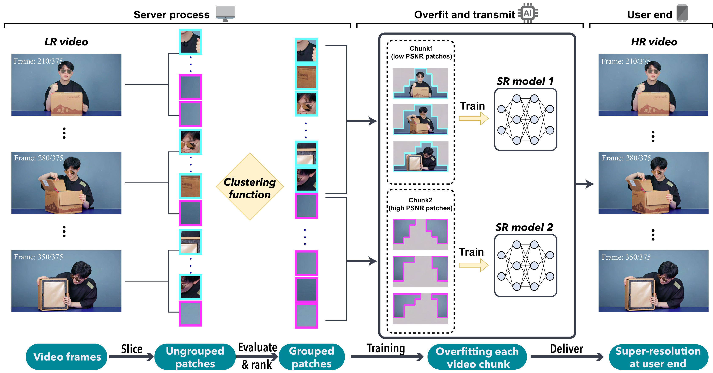
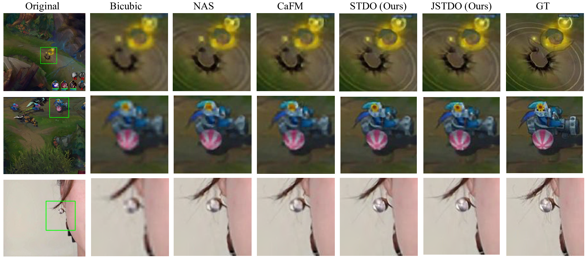
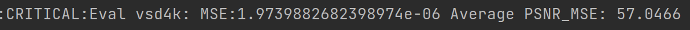

# Towards High-Quality and Efficient Video Super-Resolution via Spatial-Temporal Data Overfitting
Sample code used for CVPR 2023 highlight paper:
[Towards High-Quality and Efficient Video Super-Resolution via Spatial-Temporal Data Overfitting](https://arxiv.org/abs/2303.08331)
## Introduction
we propose a novel method for high-quality and efficient video resolution upscaling tasks, which leverages the spatial-temporal information
to accurately divide video into chunks, thus keeping the number of chunks as well as the model size to minimum. 
Additionally, we advance our method into a single overfitting model by a data-aware joint training technique, 
which further reduces the storage requirement with negligible quality drop. We deploy our models on an off-
the-shelf mobile phone, and experimental results show that
our method achieves real-time video super-resolution with
high video quality.



Overview of the proposed STDO method. Each video frame is sliced into patches, and all patches across time dimension are divided and grouped into chunks. Here we set the number of chunks to 2 for clear illustration. Then each chunk is overfitted by independent SR models, and delivered to end-user for video super-resolution.

## Experiment Result
Comparison results of STDO with different data overfitting methods on different SR backbones

| Dataset  |       | game15s |       |       | inter15s |       |       | vlog15s |       |
|:--------:|:-----:|:-------:|:-----:|:-----:|:--------:|:-----:|:-----:|:-------:|:-----:|
|  Scale   |  x2   |   x3    |  x4   |  x2   |    x3    |  x4   |  x2   |   x3    |  x4   |
|  awDNN   | 43.36 |  37.12  | 34.62 | 44.83 |  39.05   | 35.23 | 49.24 |  45.30  | 43.33 |
|   NAS    | 44.17 |  38.23  | 36.02 | 45.43 |  39.71   | 36.54 | 49.98 |  45.63  | 43.51 |
|   CaFM   | 44.23 |  38.55  | 36.30 | 45.71 |  39.92   | 36.87 | 50.12 |  45.87  | 43.79 |
| __STDO__ | 45.75 |  37.04  | 38.62 | 46.34 |  41.13   | 38.76 | 50.58 |  46.43  | 44.62 |

The following is the partial visual results.


## Requirement
* Python >= 3.6
* Torch >= 1.0.0
* torchvision
* apex
* numpy
## Dataset
The dataset(VSD4K) can be founded in [CaFM-Pytorch-ICCV2021](https://github.com/Neural-video-delivery/CaFM-Pytorch-ICCV2021)  
Please download and organize data like: 
```
path/to/data/video topic_length/
├── DIV2K_train_HR
└── DIV2K_train_LR_bicubic
    └── X2
        └─ 00001_x2.png
    └── X3
        └─ 00001_x3.png
    └── X4
        └─ 00001_x4.png
e.g.
home/lee/data/vlog_15/
├── DIV2K_train_HR
└──DIV2K_train_LR_bicubic
    └── X2
    └── X3
    └── X4
```
## Spatia & temporal patches cluster
* Please see the `script/vlog_15/vlog_15_preprocessing`. This helps generate and cluster patches according to spatia and temporal information.  
* `script/vlog_15/pre_processX2` uses a general SR model(pretrained wdsr model) to super-resolve an LR video to obtain the PSNR value of each patch.  
* Detailed implementation can be found in `VSD4K.py`

## Train
We will use `trainer.py` and `VSD4K.py` for our experiments. The key arguments and their usage are listed below.  
For `trainer.py`:  
- `--source_path` This argument specifies the path to your dataset. Default setting is:`/home/lee/data/`
- `--chunk` This argument specifies which chunk you will train.
- `--k` This argument specifies the number of chunks we want to divide into.
- `--tt` This argument specifies video topic and video length. (e.g. vlog_15, inter_45)
- `--scale` This argument specifies the scale factor for image super-resolution.. We demonstrate 2,3 and 4 results.
- `--save_img` This argument determines whether the generated images are stored.  
- `--save_label` This argument determines whether to store the PSNR value for each patches.  
- `--eval_only` This argument used for evaluation only.

For `VSD4K.py`:
- `--pre_pro` This argument determines whether to do preprocessing. 
- `--type` This argument is the same as `--scale`
- `--time` This argument specifies the video length.
- `--size_w` This argument specifies how many patches we want to split on width.
- `--size_h` This argument specifies how many patches we want to split on height.

Detailed training script can be found in `./script/vlog_15/vlog_15_train`

## Evaluate
We evaluate our framework according to PSNR value. We compute Mean Squared Error(MSE) on all the generated patches for the
final PSNR.  
The MSE for each chunk is shown below. You can find when you do training.

The final PSNR can be computed by: `psnr = -10*math.log10((mse1+mse2...mseN)/N) `
The mse1...N for each chunk1 ... N will be printed after training.

## Quick Start
We provide the checkpoint and processed data for vlog_15.
The dataset and checkpoints are available at this [link](https://drive.google.com/drive/folders/1vUZhX862M77qBcab9aSBsNIavFfD3YQE?usp=drive_link)

Please first organize the dataset as shown above. Then run `./script/vloh15/vlog_15_evaluate`

More training epochs and better learning rate schedual may yield better results. You are very welcome to try more hyperparameter settings

# Citation
if you find this repo is helpful, please cite
```
@InProceedings{Li_2023_CVPR,
    author    = {Li, Gen and Ji, Jie and Qin, Minghai and Niu, Wei and Ren, Bin and Afghah, Fatemeh and Guo, Linke and Ma, Xiaolong},
    title     = {Towards High-Quality and Efficient Video Super-Resolution via Spatial-Temporal Data Overfitting},
    booktitle = {Proceedings of the IEEE/CVF Conference on Computer Vision and Pattern Recognition (CVPR)},
    month     = {June},
    year      = {2023},
    pages     = {10259-10269}
}

```
